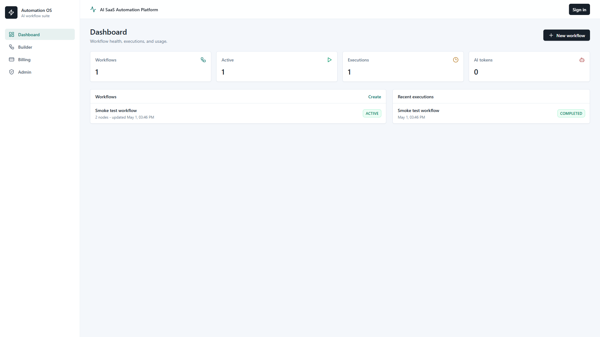
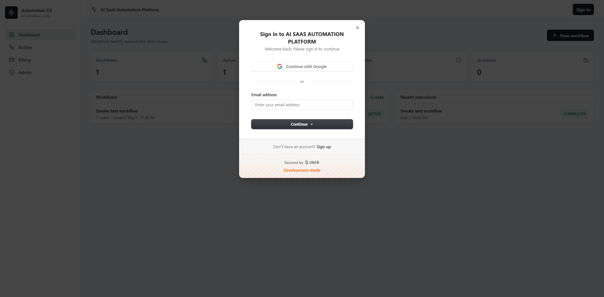
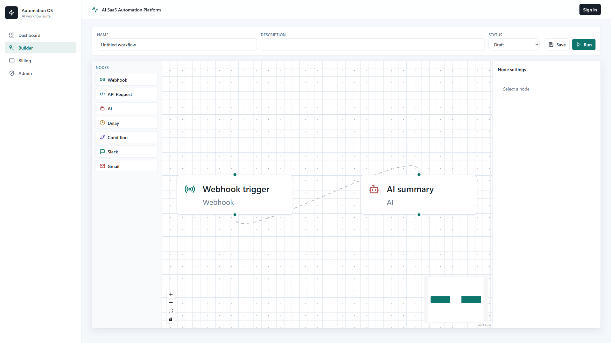
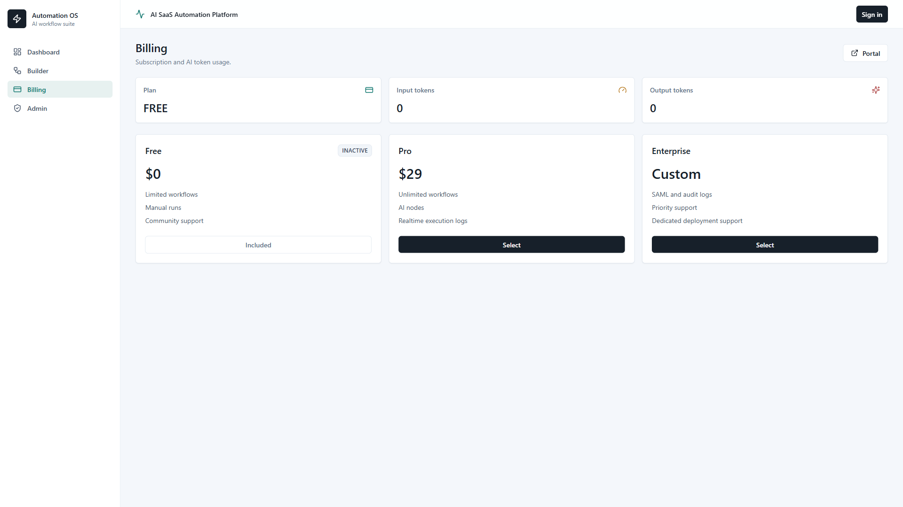
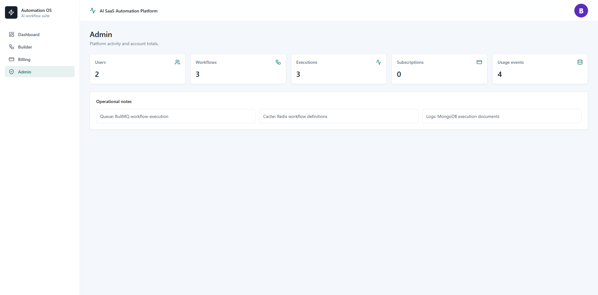

# AI SaaS Automation Platform

A production-oriented SaaS automation platform for building and running AI-powered workflows. The product combines a Zapier-style visual workflow builder with OpenAI execution nodes, API/webhook automation, realtime execution logs, Clerk authentication, Stripe subscriptions, and a Dockerized backend stack.

## Product Screenshots

### Dashboard



### Login



### Workflow Builder



### Billing



### Admin



## What This Platform Does

- Lets users create workflows visually with draggable nodes and editable node settings.
- Runs workflows asynchronously through a BullMQ worker and stores every execution log.
- Sends live execution status updates to the frontend with Socket.IO.
- Supports Clerk authentication and role-based access for `USER` and `ADMIN` accounts.
- Provides Stripe Checkout, Stripe Customer Portal, subscription webhooks, and usage tracking.
- Uses OpenAI for AI workflow steps such as prompt execution and summarization.
- Includes Slack, Gmail, webhook, API request, delay, and condition nodes.
- Uses MongoDB for workflow graphs and execution documents.
- Uses PostgreSQL for users, subscriptions, and billing usage events.
- Uses Redis for queueing, rate limiting, and workflow definition caching.
- Includes S3 presigned upload support for file workflows.

## Tech Stack

### Frontend

- Next.js App Router
- React 19
- React Flow
- Clerk for authentication UI/session handling
- Socket.IO client for realtime execution updates
- Tailwind CSS and lucide-react icons

### Backend

- Node.js, Express, TypeScript
- Socket.IO realtime service
- BullMQ workflow queue and worker
- MongoDB with Mongoose
- PostgreSQL with `pg`
- Redis with `ioredis`
- Clerk backend auth
- Stripe billing
- OpenAI API
- Google APIs for Gmail
- AWS SDK for S3 uploads

### Infrastructure

- Docker Compose for local development
- MongoDB, PostgreSQL, and Redis containers
- Backend API container
- Worker container
- Frontend container
- AWS-ready S3 integration

## Project Structure

```text
AI SAAS AUTOMATION PLATFORM/
|-- backend/
|   |-- src/
|   |   |-- config/              # Environment, Redis, logger
|   |   |-- database/            # MongoDB and PostgreSQL connections
|   |   |-- engine/              # Workflow runner, templating, conditions
|   |   |   `-- executors/       # Node executors: AI, API, Slack, Gmail, delay, condition
|   |   |-- middleware/          # Auth, rate limiting, error handling
|   |   |-- modules/
|   |   |   |-- admin/           # Admin overview API
|   |   |   |-- billing/         # Stripe checkout, portal, webhooks, usage
|   |   |   |-- executions/      # Execution models and API
|   |   |   |-- files/           # S3 presigned upload API
|   |   |   |-- integrations/    # Integration helper routes
|   |   |   |-- users/           # User repository
|   |   |   `-- workflows/       # Workflow CRUD, validation, webhook trigger
|   |   |-- queues/              # BullMQ queue producer
|   |   |-- realtime/            # Socket.IO setup and events
|   |   |-- app.ts               # Express app composition
|   |   |-- server.ts            # API entry point
|   |   `-- worker.ts            # Background worker entry point
|   |-- sql/schema.sql           # PostgreSQL schema
|   `-- Dockerfile
|-- frontend/
|   |-- src/
|   |   |-- app/
|   |   |   |-- admin/           # Admin dashboard
|   |   |   |-- billing/         # Billing plans and portal
|   |   |   |-- dashboard/       # Workflow and execution overview
|   |   |   |-- executions/      # Execution detail page
|   |   |   `-- workflows/       # New/edit workflow pages
|   |   |-- components/          # Shared shell, cards, badges, timelines
|   |   |   `-- workflow/        # Builder, node cards, config panel, catalog
|   |   `-- lib/                 # API client, formatters, shared types
|   |-- public/
|   `-- Dockerfile
|-- docs/
|   |-- API.md                   # REST and realtime endpoint overview
|   |-- ARCHITECTURE.md          # System architecture notes
|   |-- ENVIRONMENT.md           # Required environment keys
|   `-- assets/screenshots/      # README screenshots
|-- scripts/                     # Utility scripts
|-- docker-compose.yml           # Local full-stack runtime
|-- package.json                 # Workspace scripts
`-- .env.example                 # Safe environment template
```

## Core Workflow Nodes

- `Webhook`: starts a workflow from an external HTTP event.
- `API Request`: calls external APIs with templated values from prior node output.
- `AI`: sends prompts to OpenAI and stores token usage.
- `Delay`: pauses the workflow for a configured duration.
- `Condition`: branches execution using true/false comparisons.
- `Slack`: sends messages through a webhook URL or bot token and channel.
- `Gmail`: sends email with Google OAuth access.

## Local Setup

### 1. Install Dependencies

```bash
npm install
```

### 2. Create Environment File

Copy the template and fill in your own keys:

```bash
cp .env.example .env
```

On Windows PowerShell:

```powershell
Copy-Item .env.example .env
```

Keep `.env` private. It is ignored by Git and should never be committed.

### 3. Start With Docker

```bash
npm run docker:up
```

Docker runs:

- Frontend: `http://localhost:3001`
- Backend API: `http://localhost:4000`
- MongoDB: `localhost:27018`
- PostgreSQL: `localhost:5433`
- Redis: `localhost:6380`

### 4. Run Without Docker

Start MongoDB, PostgreSQL, and Redis yourself, then run:

```bash
npm run dev
npm run worker
```

In direct local mode, the frontend normally runs on `http://localhost:3000`.

## Environment Variables

The full list is documented in [docs/ENVIRONMENT.md](docs/ENVIRONMENT.md). The main groups are:

- App URLs: `BACKEND_PORT`, `FRONTEND_URL`, `NEXT_PUBLIC_API_URL`, `NEXT_PUBLIC_WS_URL`
- Databases: `MONGO_URI`, `POSTGRES_URL`, `REDIS_URL`
- Auth: `CLERK_SECRET_KEY`, `NEXT_PUBLIC_CLERK_PUBLISHABLE_KEY`
- AI: `OPENAI_API_KEY`, `OPENAI_MODEL`
- Stripe: `STRIPE_SECRET_KEY`, `STRIPE_PUBLISHABLE_KEY`, `STRIPE_WEBHOOK_SECRET`, `STRIPE_PRICE_PRO`, `STRIPE_PRICE_ENTERPRISE`
- Integrations: `SLACK_BOT_TOKEN`, `GOOGLE_CLIENT_ID`, `GOOGLE_CLIENT_SECRET`
- AWS: `AWS_REGION`, `AWS_ACCESS_KEY_ID`, `AWS_SECRET_ACCESS_KEY`, `S3_BUCKET`

## Auth And Roles

The app uses Clerk only. User roles are read from Clerk public metadata:

```json
{
  "role": "ADMIN"
}
```

Users without the `ADMIN` role are treated as normal users. Admin-only API routes and the admin dashboard require the `ADMIN` role.

## Billing

Stripe is wired for:

- Free plan display
- Pro checkout session
- Enterprise checkout session
- Customer portal session
- Subscription create/update/delete webhook handling
- AI token usage events

For local webhook testing:

```bash
stripe listen --forward-to localhost:4000/api/billing/webhook --events checkout.session.completed,customer.subscription.created,customer.subscription.updated,customer.subscription.deleted
```

Put the returned `whsec_...` value into `STRIPE_WEBHOOK_SECRET`.

## API Overview

See [docs/API.md](docs/API.md) for the endpoint list.

Main API groups:

- `/api/workflows`
- `/api/webhooks`
- `/api/executions`
- `/api/billing`
- `/api/files`
- `/api/admin`

Realtime clients subscribe to execution updates through Socket.IO using `execution:subscribe`.

## Quality Checks

```bash
npm run typecheck
npm run lint
npm run build
```

## Production Notes

- Store secrets in AWS Secrets Manager, SSM Parameter Store, or your deployment provider secret store.
- Use managed MongoDB, PostgreSQL, and Redis for production.
- Run the API and worker as separate services so execution load does not block HTTP traffic.
- Put the backend behind TLS and configure `FRONTEND_URL` for CORS.
- Configure Stripe live products and live webhook secrets before going live.
- Use least-privilege IAM permissions for S3 instead of broad AWS access.
- Rotate API keys before production if they were ever pasted into chat, screenshots, or logs.

## Documentation

- [Architecture](docs/ARCHITECTURE.md)
- [Environment Keys](docs/ENVIRONMENT.md)
- [API Overview](docs/API.md)
